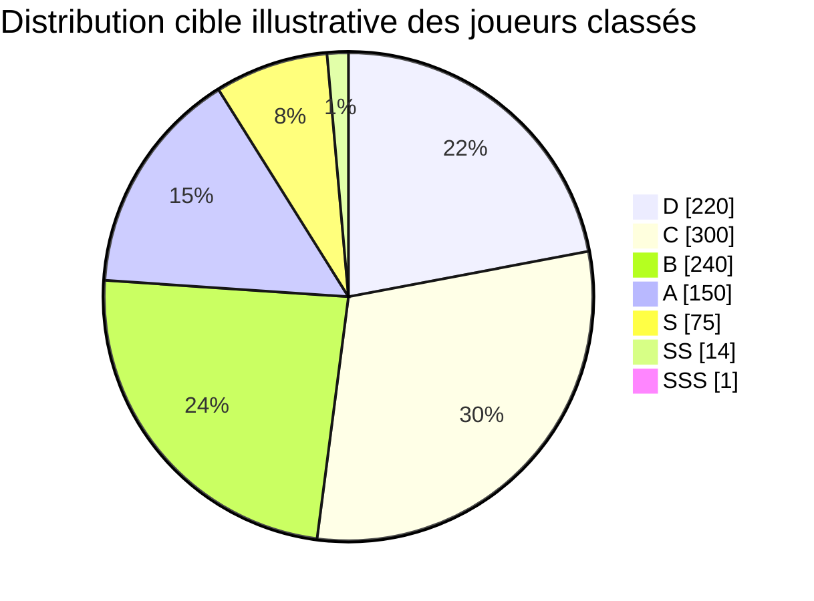
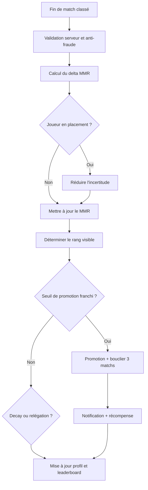
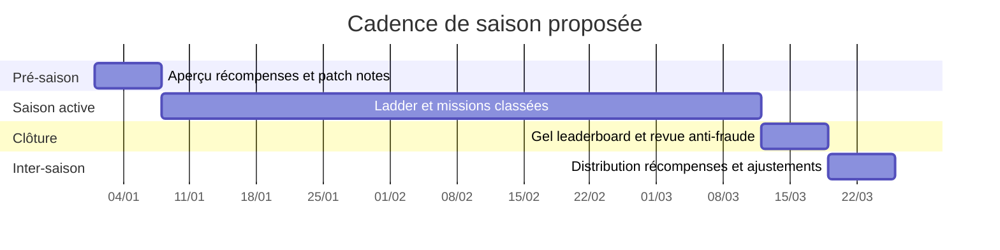

# Refonte d’un système de classement compétitif intégrable et pérenne

## Synthèse exécutive

Le document fourni pose déjà une base cohérente pour une hiérarchie compétitive lisible : départ à 1500, dix parties de classement, rangs D à SSS, et idée d’un verrou d’élite pour SS et SSS. La bonne approche n’est donc pas de repartir de zéro, mais de conserver cette ossature et de la transformer en système de production : une cote continue type Elo/MMR en interne, des rangs visibles stables pour les joueurs, un onboarding plus sûr, des garde-fous de promotion/relégation, et une couche saisonnière centrée sur les récompenses et le leaderboard plutôt que sur des remises à zéro brutales. fileciteturn0file0

Les références les plus utiles montrent des philosophies complémentaires. La réglementation Elo de la entity["organization","FIDE","chess federation"] reste très solide pour le cœur mathématique du rating : différence de niveau, probabilité attendue, puis ajustement par coefficient K. À l’inverse, les systèmes de service live comme ceux de entity["company","Riot Games","video game developer"] sur entity["video_game","League of Legends","moba 2009"] ou de entity["company","Blizzard Entertainment","video game publisher"] sur entity["video_game","Overwatch 2","hero shooter 2022"] montrent l’intérêt d’un MMR interne, de placements, de restrictions d’intégrité à haut niveau, et de récompenses récurrentes. citeturn8view1turn6view3turn6view2turn7view0turn7view1turn9view0

La recommandation centrale de ce rapport est la suivante : **conserver les bandes visibles D–SSS du document**, mais **faire porter l’équilibrage réel sur un MMR caché** et sur des règles de fonctionnement mieux calibrées. Cela permet de garder la familiarité de votre système existant tout en gagnant en robustesse technique, en clarté UX et en résistance à l’abus. fileciteturn0file0

| Sujet | Recommandation par défaut |
|---|---|
| Architecture | MMR caché persistant + rangs visibles D/C/B/A/S/SS/SSS |
| Bandes visibles | Conserver 1000–1399, 1400–1799, 1800–2199, 2200–2599, 2600–2899, 2900–3199, 3200+ |
| Placement | 10 matchs, seed 1500, accélération via forte incertitude |
| Progression | Pas de séries de promotion, promotion immédiate au seuil, bouclier de 3 matchs |
| Decay | Aucun decay pour D à A, decay léger à partir de S, plus fort en SS/SSS |
| Saisons | 12 semaines, récompenses et leaderboard saisonniers, **sans hard reset du MMR** |
| Files classées | 1v1 classé standard comme ladder principale, BO3 optionnel, tournois séparés |
| Intégrité | Détection smurf, anti-collusion, pénalités leave/AFK, rematch protection, revue analytics |
| Visibilité | MMR exact au joueur sur son profil, visibilité publique graduée selon le rang |
| Migration | Mapping quasi 1:1 au lancement, compression légère des extrêmes, 5 matchs de recalibration |

Ce compromis est, à mon sens, le plus professionnel pour une communauté de jeu en croissance : il garde la lisibilité d’un système Elo continu, reprend les forces de présentation et d’opérations d’un ladder moderne, et évite les défauts classiques d’un Elo trop nu dans un environnement live. citeturn8view1turn6view3turn7view1

## Cadre de référence et enseignements comparatifs

Le système décrit dans votre document a trois qualités structurelles qu’il faut préserver : des seuils simples, une montée en prestige crédible vers S/SS/SSS, et un démarrage à 1500 qui laisse de la place pour monter ou descendre. Là où il faut le renforcer, c’est sur l’exploitation live : qualité de matching, contrôle des très hauts rangs, gestion de l’inactivité, onboarding des nouveaux comptes, visibilité des statistiques, et instrumentation produit. fileciteturn0file0

Dans un Elo classique, la variation de rating repose sur la différence entre le résultat réel et la probabilité attendue, multipliée par un coefficient de développement K. La entity["organization","FIDE","chess federation"] utilise par exemple K = 40 pour les nouveaux joueurs, K = 20 sous 2400 et K = 10 au-dessus de 2400, avec un plafonnement du différentiel de rating à 400 points pour la plupart des joueurs. Cette philosophie est excellente pour le moteur mathématique, mais elle ne couvre pas à elle seule les besoins d’un produit jeu vidéo : récompenses, perception sociale du rang, protection contre la manipulation, ou cadence de contenu. citeturn8view1

### Tableau comparatif

| Système de référence | Ce qu’il fait bien | Ce qu’il ferait moins bien s’il était copié tel quel | Ce qu’il faut en retenir pour votre jeu | Référence |
|---|---|---|---|---|
| Elo d’échecs | Très lisible mathématiquement ; variation basée sur score attendu vs score réel ; K plus élevé pour les nouveaux joueurs | Peu de couches UX, pas de seasonalité produit, peu d’outils natifs contre smurfs/abuse dans un live game | Conserver le cœur de calcul Elo-like pour le MMR interne | citeturn8view1 |
| Ladder de entity["video_game","League of Legends","moba 2009"] | MMR caché, rang visible plus compréhensible, 5 placements, promotions automatiques à 100 PL, restrictions plus strictes au haut niveau, saisons avec récompenses | Système plus complexe à lire pour les joueurs si on multiplie trop les couches | Reprendre la séparation entre compétence interne et présentation externe, plus la cadence de récompenses | citeturn6view3turn6view2turn6view1turn9view0 |
| Compétitif de entity["video_game","Overwatch 2","hero shooter 2022"] | Rang plus directement lié au MMR, placements à certains resets, anti-boosting via groupes larges, pénalités leave fortes, leaderboard et récompenses élite | Pensé pour un jeu d’équipe, donc pas transposable en bloc à un jeu 1v1 | Reprendre les garde-fous d’intégrité, les récompenses élite et la logique de protection des files haut niveau | citeturn7view0turn7view1 |

La conclusion comparative est nette : **la meilleure solution pour votre jeu n’est ni un Elo pur, ni une copie d’un ladder MOBA/FPS, mais un hybride**. Le calcul interne doit rester simple, déterministe et auditable. L’expérience joueur, elle, doit être enrichie par un rang visible, des messages de progression, une cadence de récompenses, et des protections contre les comportements opportunistes. citeturn8view1turn6view3turn7view0

## Architecture de classement proposée

Je recommande de **conserver les bandes visibles du document**, mais d’ajuster non pas les grands intervalles affichés, plutôt **les seuils opérationnels** : seuil de promotion réel, seuil de relégation réel, buffer anti-yo-yo, et conditions supplémentaires pour SS/SSS. C’est le meilleur arbitrage entre continuité communautaire, migration fluide et équilibre du ladder. fileciteturn0file0

### Spécification des rangs

| Rang | Bande visible proposée | Promotion | Relégation | Cible de population | Rationale opérationnelle |
|---|---:|---:|---:|---:|---|
| D | 1000–1399 | Entrée / sortie de placement | Floor à 1000 | 22 % | Espace d’apprentissage, forte variance tolérée |
| C | 1400–1799 | ≥ 1400 | < 1370 après bouclier | 30 % | Socle du ladder, compréhension correcte du jeu |
| B | 1800–2199 | ≥ 1800 | < 1770 après bouclier | 24 % | Cœur compétitif, joueurs réguliers |
| A | 2200–2599 | ≥ 2200 | < 2170 après bouclier | 15 % | Maîtrise solide, début de spécialisation |
| S | 2600–2899 | ≥ 2600 | < 2570 après bouclier | 7,5 % | Haut niveau, intégrité prioritaire |
| SS | 2900–3199 | ≥ 2900 + éligibilité élite | < 2875 ou perte d’éligibilité | 1,4 % | Élites visibles, forte stabilité demandée |
| SSS | 3200+ | ≥ 3200 + éligibilité élite | < 3175 ou perte d’éligibilité | 0,1 % | Sommet du ladder, rareté assumée |

Cette table ne modifie pas les bandes visibles d’origine ; elle affine la façon dont le système les exploite. La principale amélioration est le **buffer de relégation** : un joueur promu ne redescend pas au premier faux pas, ce qui réduit l’effet “ascenseur” sans figer artificiellement le ladder. fileciteturn0file0

### Éligibilité élite pour SS et SSS

Le document d’origine propose un verrou très strict pour SS et SSS, allant jusqu’à suggérer une activation réellement pertinente à très grande échelle. C’est intellectuellement cohérent, mais trop rigide pour une communauté encore en croissance. Je recommande donc une règle **phased rollout** :

| Taille de la population classée active sur 30 jours | SS | SSS |
|---|---|---|
| < 20 000 | MMR seul | MMR seul |
| 20 000 à 100 000 | 2900+ **et** top 1,5 % | 3200+ **et** top 0,1 % |
| > 100 000 | 2900+ **et** top 1,0 % | 3200+ **et** top 0,05 % |

Autrement dit : au début, le **rang élite doit rester atteignable par seuil absolu** pour éviter des tiers vides. Ensuite, la rareté percentile prend le relais. C’est une adaptation plus exploitable du principe de plafonnement présent dans le document. fileciteturn0file0

### Distribution cible illustrative

Le ladder doit être **massif au centre** et **rarefié au sommet**. Une distribution trop plate rend les rangs peu crédibles ; une distribution trop pyramidale frustre la majorité.



Cette répartition est un **jeu d’exemple** pour le pilotage du ladder. Elle n’est pas une vérité universelle, mais un bon point de départ pour des dashboards d’inflation/déflation de rangs.

## Règles de progression, matchmaking et onboarding

Le moteur de rating recommandé doit rester **Elo-like**, donc facile à auditer. La logique la plus saine consiste à calculer une probabilité de victoire à partir du différentiel de cote, puis à ajuster la cote par un K-factor. C’est précisément le principe central de l’Elo FIDE, que j’adapte ici aux contraintes d’un jeu en ligne. citeturn8view1

### Types de matchs et K-factors

Pour un jeu compétitif principalement 1v1, je recommande une ladder officielle centrée sur la file **Classé Standard**. Un mode **Classé Série BO3** peut coexister, mais sans cannibaliser la file principale. Les tournois, eux, doivent être **séparés du MMR principal** pour éviter que quelques événements à faible fréquence déforment le ladder.

| Type de match | Impact sur le MMR principal | K-factor recommandé | Règle |
|---|---:|---:|---|
| Placement match 1 à 5 | Oui | 60 | Forte mobilité, incertitude élevée |
| Placement match 6 à 10 | Oui | 40 | Convergence plus fine |
| Classé Standard 1v1 | Oui | 32 en D–B / 24 en A–S / 16 en SS–SSS | File principale |
| Classé Série BO3 | Oui | Base × 1,10, cap ±40 | Bonus d’information, variance réduite |
| Tournoi homologué | Non | — | Utiliser un score de tournoi séparé |
| Casual / normal | Non | — | Sert à seeder un nouveau compte si disponible |

Deux choix sont importants ici. D’abord, **pas de séries de promotion** : la promotion doit être automatique au seuil, comme dans les systèmes modernes qui privilégient la fluidité. Ensuite, **pas de bonus MMR globaux pour les win streaks** : une série de victoires ne doit accélérer la cote que pendant la phase provisoire ou lorsqu’un compte est manifestement mal calibré, sinon vous récompensez la forme de la séquence plus que le niveau réel. Riot a d’ailleurs adopté des promotions automatiques à 100 PL, et non un enchaînement de “promo series” répétitives. citeturn6view2

### Promotion, relégation, bouclier et inactivité

| Règle | Recommandation |
|---|---|
| Promotion | Immédiate au franchissement du seuil |
| Bouclier de promotion | 3 matchs classés ou 7 jours, selon la première échéance |
| Relégation D–A | Quand la cote passe sous le seuil du rang précédent moins 30 points |
| Relégation S | Sous 2570 après bouclier |
| Relégation SS | Sous 2875 ou perte d’éligibilité élite 2 semaines de suite |
| Relégation SSS | Sous 3175 ou perte d’éligibilité élite à la revue hebdomadaire |
| Decay D–A | Aucun |
| Decay S | Après 21 jours d’inactivité : -25 MMR par semaine |
| Decay SS | Après 14 jours : -35 MMR par semaine |
| Decay SSS | Après 7 jours : -50 MMR par semaine, retrait du leaderboard si nécessaire |

Le document d’origine insiste à juste titre sur l’idée que les rangs les plus hauts doivent être “défendus” activement. Je recommande cependant de ne pas étendre cette logique à tout le ladder. Le decay doit modeler le sommet, pas punir la majorité. fileciteturn0file0

### Contraintes de matchmaking et fenêtres par paliers

Pour un jeu 1v1, l’objectif n’est pas seulement de rapprocher les cotes, mais de protéger la **qualité de l’expérience**. Le ladder doit donc élargir progressivement sa recherche.

| Segment de rang | 0–30 s | 30–90 s | 90–180 s | 180 s+ |
|---|---:|---:|---:|---:|
| D à B | ±75 | ±125 | ±175 | ±225 |
| A à S | ±60 | ±100 | ±150 | ±200 |
| SS à SSS | ±40 | ±80 | ±120 | ±180 |

Règles additionnelles recommandées :

| Sujet | Règle proposée |
|---|---|
| Rematch protection | Éviter plus de 2 matchs contre le même adversaire en 60 min si le pool > 20 joueurs |
| Sniping haut niveau | Pseudo masqué en file pour S+ ; journalisation des files élite |
| Cross-region | Autorisé au-delà de 180 s uniquement si la latence estimée reste acceptable |
| BO3 | Pool séparé ou élargissement initial plus large pour éviter les temps d’attente excessifs |
| Matchmaking élite | Revue qualité manuelle hebdomadaire des logs SS/SSS |

Les politiques de haut niveau de Riot et Blizzard convergent sur un point : **plus on monte, plus les contraintes deviennent strictes**, parce que la valeur symbolique du ladder augmente et que les abus coûtent plus cher au système. citeturn6view1turn7view0

### Algorithme de placement et onboarding des nouveaux joueurs

Le document fourni propose déjà 10 matchs de classement, ce qui est une bonne base. Je conserve ce choix. En revanche, je recommande de **ne pas afficher de rang avant la fin des 10 matchs**, même si le seed interne part à 1500. Cela évite l’impression trompeuse qu’un nouveau joueur “est C” sans avoir encore prouvé son niveau. fileciteturn0file0

Riot utilise aussi le MMR non classé pour seeder les placements lorsque le joueur n’a pas encore de référence classée. C’est une excellente pratique si votre jeu dispose déjà d’un mode normal avec suffisamment de données. citeturn6view2

L’algorithme recommandé est le suivant :

```text
seed_mmr = normal_mmr_clamp(1300, 1700) si disponible, sinon 1500
uncertainty = 1.40
for match in 1..10:
    expected = elo_expected(seed_mmr, opponent_avg_mmr)
    K = 60 si match <= 5 sinon 40
    series_bonus = bonus_bo3_cappe(-8,+8) si mode BO3 sinon 0
    delta = (K * (resultat - expected) * uncertainty) + series_bonus
    seed_mmr = clamp(seed_mmr + delta, 1000, 3400)
    uncertainty = max(1.00, uncertainty - 0.04)
final_mmr = seed_mmr
rang_visible = band(final_mmr)
bouclier = 3 matchs
```

Trois raffinements rendent cet onboarding bien plus robuste qu’un placement naïf.

D’abord, **l’incertitude** baisse rapidement sur les 10 premiers matchs, ce qui permet à un smurf ou à un joueur très faible de quitter vite le milieu artificiel du seed 1500. Ensuite, si le jeu se joue parfois en série, un **micro-ajustement par différentiel de manches** est acceptable, mais il doit rester capé pour éviter les comportements opportunistes. Enfin, dans un jeu de cartes ou de stratégie 1v1, mieux vaut **éviter les métriques de performance in-match trop fines** si elles peuvent être manipulées ; le résultat de match doit rester le signal principal. fileciteturn0file0

### Diagramme de progression de rang

Le diagramme ci-dessous montre le flux logique recommandé après chaque match classé.



## Intégration produit, API et expérience utilisateur

Un point de design souvent négligé est la **visibilité du ranking**. Riot explique explicitement que le MMR brut, sorti de son contexte, devient moins utile pour les joueurs, d’où l’usage de rangs plus lisibles. Blizzard, à l’inverse, met davantage l’accent sur le fait que le rang doit refléter la compétence réelle. La bonne synthèse pour votre jeu est la suivante : **MMR exact visible au joueur sur son propre profil, mais exposition publique graduée**. citeturn6view3turn7view1

### Statistiques visibles par rang

| Rang | Visible au joueur concerné | Visible aux autres joueurs |
|---|---|---|
| D | Rang, MMR exact, parties jouées, WR saison, série actuelle | Rang, parties jouées |
| C | Rang, MMR exact, parties jouées, WR saison, série actuelle | Rang, parties jouées, WR sur les 20 dernières |
| B | Rang, MMR exact, parties jouées, WR saison, série actuelle, pic saison | Rang, parties jouées, WR saison arrondi |
| A | Rang, MMR exact, parties jouées, WR saison, série actuelle, pic saison, percentile | Rang, WR saison, pic saison |
| S | Rang, MMR exact, parties jouées, WR saison, série actuelle, percentile | Rang, MMR public, percentile, parties jouées |
| SS | Rang, MMR exact, leaderboard, pic saison, statut decay | Rang, MMR public, position leaderboard, parties jouées |
| SSS | Rang, MMR exact, leaderboard global/régional, statut decay, pic historique | Rang, MMR public, position leaderboard, pic historique |

Cette graduation répond à deux objectifs contraires : **donner de la transparence à ceux qui veulent progresser**, sans transformer les rangs moyens en espace de toxicité statistique. En pratique, les stats publiques les plus sensibles doivent être réservées aux rangs où la dimension compétitive et la pression de preuve sont déjà assumées.

### Modèle de données et API

| Ressource | Champs clés | Endpoint suggéré | Note d’intégration |
|---|---|---|---|
| `ranked_profile` | `player_id`, `queue_id`, `mmr_hidden`, `rank_visible`, `peak_rank`, `peak_mmr`, `games_ranked_total`, `games_ranked_season`, `winrate_season`, `current_streak`, `last_ranked_at` | `GET /v1/ranked/profile/{playerId}` | Lecture client, cache court |
| `placement_state` | `player_id`, `matches_remaining`, `seed_mmr`, `uncertainty`, `normal_mmr_seeded`, `smurf_watch_flag` | `GET /v1/ranked/placement/{playerId}` | Interne + UI onboarding |
| `match_result_ingest` | `match_id`, `queue_id`, `players[]`, `result`, `opponent_avg_mmr`, `best_of`, `region`, `anti_cheat_verdict`, `idempotency_key` | `POST /v1/ranked/matches/resolve` | **Serveur autoritaire**, idempotent |
| `rank_event_log` | `event_id`, `player_id`, `match_id`, `mmr_before`, `mmr_after`, `delta`, `old_rank`, `new_rank`, `reason_code` | `GET /v1/ranked/history/{playerId}` | Audit support et debugging |
| `leaderboard_entry` | `season_id`, `queue_id`, `player_id`, `rank_visible`, `mmr_public`, `percentile`, `wins`, `losses`, `decay_status` | `GET /v1/ranked/leaderboard` | Snapshot régulier |
| `penalty_state` | `player_id`, `leaves_last20`, `afk_last20`, `suspension_until`, `season_ban`, `fair_play_score`, `reports_weighted` | `GET /v1/ranked/penalties/{playerId}` | Mutualiser avec modération |
| `rank_config` | `rank_bands`, `promotion_buffers`, `decay_rules`, `queue_windows`, `elite_caps`, `season_rules`, `schema_version` | `GET /v1/ranked/config` | Permet le tuning sans patch client |
| `telemetry_ranked_event` | `player_id`, `match_id`, `queue_time_ms`, `predicted_win_prob`, `delta_mmr`, `rematch_flag`, `smurf_score`, `season_id` | `POST /v1/telemetry/ranked` | Data warehouse / dashboards |

Notes d’intégration essentielles :

| Sujet | Recommandation |
|---|---|
| Autorité | Tous les calculs de MMR doivent être côté serveur |
| Résilience | Le traitement match doit être idempotent avec `idempotency_key` |
| Auditabilité | Conserver un journal append-only des changements de rang |
| Tuning | Paramétrer bandes, K, decay et fenêtres de matching dans `rank_config` |
| Sécurité | Aucun client ne doit pouvoir écrire directement un delta de rating |
| Support | Prévoir un endpoint d’historique lisible par le support pour les contestations |

### Exemples de libellés UI et de flux UX

| Contexte | Texte recommandé |
|---|---|
| Profil | `Rang B • 1864 MMR • 52 % de victoires • 84 parties` |
| Placement | `10 matchs de classement. Vos premiers résultats ajusteront votre cote plus vite.` |
| Promotion | `Promotion validée : vous passez rang A.` |
| Bouclier | `Bouclier de rang actif pendant 3 matchs.` |
| Alerte relégation | `Attention : vous êtes à 18 MMR du seuil de relégation.` |
| Élites | `Rang SS obtenu. Activité requise pour conserver votre position.` |
| Fin de saison | `Récompense saisonnière débloquée : dos de carte A + titre exclusif.` |
| Leaderboard | `Top 100 Europe • Mise à jour il y a 4 minutes` |

Le flux UX recommandé est sobre : **résultat de match → variation de MMR → progression vers le prochain seuil → éventuelle promotion → éventuelle récompense**. Le système ne doit jamais noyer le joueur sous des écrans denses ; il doit rendre la progression immédiatement intelligible.

## Récompenses, intégrité compétitive et pilotage

Les systèmes modernes montrent que les récompenses fonctionnent mieux lorsqu’elles cumulent trois dimensions : **visibilité sociale**, **persistence saisonnière**, et **rareté crédible**. Riot met en avant bordures, blasons, skins saisonniers et gating par comportement ; Blizzard ajoute des récompenses de leaderboard et des récompenses très lisibles pour le Top de la ladder. citeturn9view0turn7view1

### Structure de récompenses par rang

Dans le contexte d’un jeu compétitif de cartes ou de stratégie, les meilleures récompenses sont celles qui ne touchent jamais au power level : dos de carte, sleeves, plateaux, avatars, bordures, effets visuels, titres.

| Rang | Récompense d’atteinte | Récompense de fin de saison | Incentive communautaire |
|---|---|---|---|
| D | Icône de rang de base | 1 sleeve commune + badge saisonnier | Sentiment d’entrée dans le compétitif |
| C | Bordure de profil | Sleeve rare + bannière profil | Première reconnaissance visible |
| B | Dos de carte exclusif | Dos de carte animé léger + titre | Palier du “joueur classé régulier” |
| A | Avatar animé | Plateau visuel ou effet de mulligan cosmétique | Rang de prestige solide |
| S | Bordure premium + bannière de deck | Variante visuelle de plateau + titre élite | Entrée vraie dans le haut niveau |
| SS | Titre exclusif + aura de profil | Sleeve animée unique + badge leaderboard | Preuve sociale très visible |
| SSS | Titre légendaire + Hall of Fame | Skin cosmétique signature saisonnière + trophée profil | Sommet communautaire et narratif |

Conditions d’éligibilité recommandées :

| Condition | Valeur proposée |
|---|---|
| Victoires minimum pour toucher les récompenses de saison | 25 |
| Niveau de fair-play minimum | Score comportemental sain |
| Récompenses leaderboard | Snapshot final + revue anti-fraude |
| Récompenses SS/SSS | Basées sur **rang final**, pas seulement rang atteint |

Le point le plus important est d’éviter les récompenses “hit-and-run”. Un joueur ne devrait pas toucher la totalité des gains d’élite simplement pour avoir effleuré SS pendant une heure. Il faut récompenser **le rang final**, avec éventuellement un petit souvenir du **peak atteint**.

### Anti-abuse et mitigation smurf

Les documents officiels de Riot et Blizzard montrent deux idées très utiles : limiter la manipulation du matchmaking au haut niveau, et pénaliser fortement les comportements destructeurs comme les leaves répétés ou le boosting indirect par mismatch de skill. Blizzard dit même explicitement que certains aménagements de groupes larges visent à éviter que des joueurs montent sur des comptes alternatifs pour jouer avec leurs amis. citeturn6view1turn7view0turn7view1

| Risque | Contremesure recommandée |
|---|---|
| Smurf | Déblocage du classé après onboarding réel ; seed via MMR normal ; accélération cachée du MMR si le compte surperforme fortement |
| Sandbagging volontaire | Détection des pertes anormales, alternance win/loss suspecte, anomalies de deck choice |
| Win-trading | Blocage des rematchs répétés, détection de graphes adverses récurrents, revue manuelle SS/SSS |
| Boosting | Récompenses basées sur rang final + minimum de parties + statut fair-play |
| Leave / AFK | Suspensions progressives, annulation d’éligibilité saisonnière, ban de saison au-delà d’un seuil |
| Queue sniping | Masquage d’identité en file S+, randomisation légère des fenêtres, cooldown de rematch |
| Multiples comptes | Vérification e-mail/téléphone pour le classé, scoring appareil/IP/empreinte comportementale |
| Exploit BO3 | Cap de gain/perte par série, logs serveur, tournoi séparé de la ladder principale |

Pour le **smurf scoring**, un pipeline simple mais efficace suffit au départ :

- compte âgé de moins de 14 jours ;
- winrate > 70 % sur 15 matchs classés ;
- écart moyen de MMR adverse > 150 points à son bénéfice ;
- séries de victoire contre des joueurs déjà bien établis.

Quand ces signaux convergent, la bonne réponse n’est pas un ban automatique, mais un **recalibrage accéléré** : MMR qui grimpe plus vite, matchmaking plus exigeant, disparition rapide des matchs à faible niveau. Cela protège la base de joueurs sans créer trop de faux positifs.

### Télémétrie et dashboards

Un ladder compétitif ne se pilote pas “au ressenti”. Il faut des tableaux de bord permanents.

| Dashboard | KPI principal | Pourquoi c’est critique | Seuil d’alerte initial |
|---|---|---|---|
| Équité de match | Taux de victoire observé vs probabilité prédite | Vérifie si le MMR prédit bien les résultats | Écart > 3 points |
| Temps d’attente | P50 / P90 par rang | Évite que l’élite vide le ladder | P90 > 180 s en S+ |
| Économie des rangs | Distribution par rang vs cible | Détecte inflation et déflation | Écart > 1,5 point de % |
| Stabilité des promotions | Promotions / relégations par semaine | Détecte le yo-yo | Ratio hors plage 0,9–1,1 |
| Santé des placements | Écart entre MMR après 10 matchs et après 30 matchs | Mesure la qualité du provisoire | Médiane > 120 MMR |
| Intégrité | Leaves, AFK, reports pondérés, suspensions | Mesure la toxicité structurelle | Leaves > 1,5 % des matchs |
| Smurf control | % comptes suspects reclassés en < 20 matchs | Vérifie la vitesse de convergence | Trop faible = ladder pollué |
| Qualité du sommet | Rematch rate en SS/SSS, vacance des tiers élite | Vérifie prestige + densité | Rematch répétés ou tiers vides |

Je recommande aussi quatre graphiques de suivi hebdomadaire obligatoires :

1. **Courbe de distribution de la population par rang**  
2. **Temps d’attente P50/P90 par rang**  
3. **Écart entre winrate attendu et winrate observé par bande de MMR**  
4. **Taux de churn des nouveaux placés à J7/J30**

Sans ces dashboards, vous ne réglez pas un ladder ; vous le subissez.

## Migration et communication

Votre avantage est que vous partez d’un système déjà articulé autour d’une cote continue et de seuils de rang explicites. Cela permet une migration très peu traumatique. Le document fourni propose déjà les mêmes grands jalons visibles que ceux recommandés ici. fileciteturn0file0

### Plan de migration des joueurs existants

| Phase | Action | Règle proposée |
|---|---|---|
| Préparation | Snapshot de l’ancien ladder | Geler l’Elo existant à J-1 |
| Fiabilité | Calcul d’un score de confiance | Basé sur les parties jouées sur 90 jours |
| Mapping initial | Conversion ancien Elo → nouveau MMR | 1:1 pour la majorité ; compression légère des extrêmes |
| Protection de choc | Limitation des changements visibles | Pas plus d’un rang majeur de différence le jour J |
| Recalibration | 5 matchs de requalification douce | K temporaire = 40 |
| Élites | Revue spécifique SS/SSS | Recalcul hebdomadaire avec règles d’éligibilité |
| Support | Journal d’historique accessible | Permettre à l’équipe support d’expliquer chaque variation |

Formule de mapping recommandée :

```text
reliability = min(1, games_ranked_90d / 50)
mmr_raw = 1500 + ((old_elo - 1500) * 0.95)
new_mmr = 1500 + ((mmr_raw - 1500) * reliability)
si player_inactive_90d:
    new_mmr = (new_mmr * 0.8) + (1500 * 0.2)
    placer 5 matchs de recalibration
```

L’idée n’est pas de “punir” les anciens joueurs, mais de **neutraliser les ratings historiquement fragiles** : comptes très inactifs, très peu joués, ou artificiellement gonflés. Pour les joueurs fortement engagés et actifs, le mapping doit rester quasi transparent.

### Plan de communication communautaire

| Échéance | Message | Canal |
|---|---|---|
| T-30 jours | Pourquoi la refonte existe, ce qui ne change pas, ce qui change | Article long-form + FAQ |
| T-21 jours | Simulateur personnel de migration | Client + site |
| T-14 jours | Détail des récompenses, des placements et du decay | Article + réseaux |
| T-7 jours | Horaires, maintenance, support, politique anti-abus | In-game + Discord + mail |
| Jour J | Résumé visuel, placement, récompenses de bienvenue | Écran d’accueil |
| T+7 jours | Premier rapport de santé du ladder | Article transparence |
| T+30 jours | Ajustements de K / decay / fenêtres si nécessaire | Patch note + changelog |

Le ton de communication doit être très clair sur quatre points :

- **les rangs D–SSS restent** ;
- **les anciens joueurs ne perdent pas arbitrairement leur historique** ;
- **la saison ne remet pas la compétence à zéro** ;
- **la refonte améliore la qualité des matchs et la crédibilité du sommet**.

### Cadence saisonnière proposée

Le document d’origine visait un classement continu sans saisons fixes. Je recommande de préserver cette continuité sur le **MMR**, tout en ajoutant une **couche saisonnière légère** pour les récompenses, les missions classées et le leaderboard. C’est le meilleur compromis entre stabilité compétitive et animation live. fileciteturn0file0



Ce cycle de 12 semaines peut se répéter 4 fois par an. Le **MMR persiste** entre les saisons. Ce qui se réinitialise, ce sont les missions saisonnières, la course au leaderboard et le package cosmétique. Un **soft reset annuel optionnel** ne doit être envisagé que si vos dashboards montrent une inflation durable du haut de ladder.

En synthèse, la meilleure refonte pour votre communauté consiste à **garder votre structure D à SSS et vos bandes visibles actuelles**, à **mettre l’exactitude du skill dans un MMR caché**, à **réserver la seasonalité aux récompenses et à l’animation live**, et à **faire du sommet du ladder un espace activement défendu et instrumenté**. C’est une architecture crédible pour le lancement, stable en exploitation, et suffisamment souple pour évoluer avec la taille réelle de votre base de joueurs.